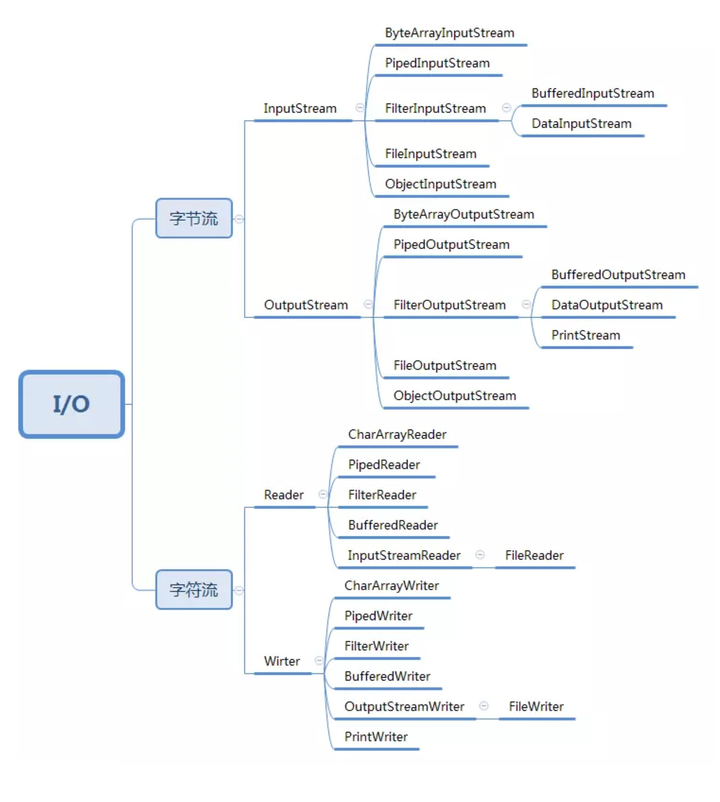
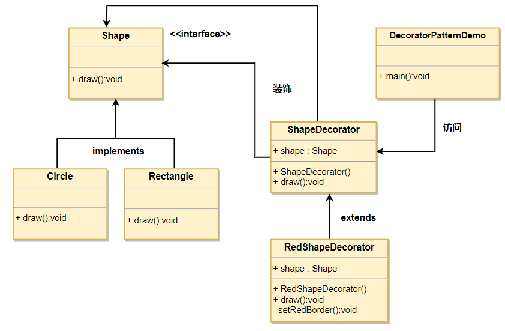

## Java设计模式 ———— 装饰器模式

### 一、介绍

#### 意图

> 动态地给一个对象添加一些额外的职责。就增加功能来说，装饰器模式相比生成子类更为灵活。

#### 主要解决

> 一般的，我们为了扩展一个类经常使用继承方式实现，由于继承为类引入静态特征，并且随着扩展功能的增多，子类会很膨胀。

#### 何时使用

> 在不想增加很多子类的情况下扩展类。

#### 如何解决
 
> 将具体功能职责划分，同时继承装饰者模式。

#### 案例

> Java IO 类的设计

### 二、优缺点

#### 优点

> 装饰类和被装饰类可以独立发展，不会相互耦合，装饰模式是继承的一个替代模式，装饰模式可以动态扩展一个实现类的功能。

#### 缺点

> 多层装饰比较复杂。

### 三、使用场景

> 1、扩展一个类的功能。 
> 
> 2、动态增加功能，动态撤销。

### 四、DEMO

> 我们创建一个 Shape 接口和实现了 Shape 接口的实体类。
>
> 然后我们创建一个实现了 Shape 接口的抽象装饰类 ShapeDecorator，并把 Shape 对象作为它的实例变量。
>
> RedShapeDecorator 是实现了 ShapeDecorator 的实体类。

### 五、和代理模式的区别

    /**
     * 代理模式的代码结构(下面的接口也可以替换成抽象类)
     */
    public interface IA {
      void f();
    }
    public class A impelements IA {
      public void f() { //... }
    }
    public class AProxy implements IA {
      private IA a;
      public AProxy(IA a) {
        this.a = a;
      }
      
      public void f() {
        // 新添加的代理逻辑
        a.f();
        // 新添加的代理逻辑
      }
    }
    
    /** 
     * 装饰器模式的代码结构(下面的接口也可以替换成抽象类)
     */    
    public interface IA {
      void f();
    }
    public class A implements IA {
      public void f() { //... }
    }
    public class ADecorator implements IA {
      private IA a;
      public ADecorator(IA a) {
        this.a = a;
      }
      
      public void f() {
        // 功能增强代码
        a.f();
        // 功能增强代码
      }
    }
    
代理模式：
> 代理模式在不改变原始类接口的条件下，为原始类定义一个代理类，主要目的是控制访问，而非加强功能，这是它跟装饰器模式最大的不同。

装饰器模式：
> 装饰器模式在不改变原始类接口的情况下，对原始类功能进行增强，并且支持多个装饰器的嵌套使用。