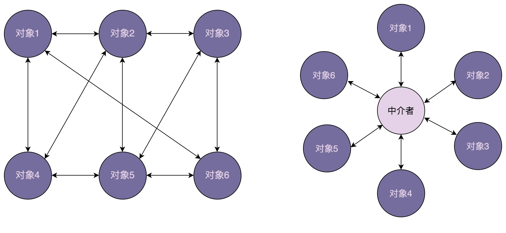

## Java设计模式 ———— 中介模式

### 一、介绍

#### 定义

> 中介模式定义了一个单独的（中介）对象，来封装一组对象之间的交互。将这组对象之间的交互委派给与中介对象交互，来避免对象之间的直接交互。

#### 意图

> 用一个中介对象来封装一系列的对象交互，中介者使各对象不需要显式地相互引用，从而使其耦合松散，而且可以独立地改变它们之间的交互。

#### 主要解决

> 对象与对象之间存在大量的关联关系，这样势必会导致系统的结构变得很复杂，同时若一个对象发生改变，我们也需要跟踪与之相关联的对象，同时做出相应的处理。

#### 何时使用

> 多个类相互耦合，形成了网状结构。

#### 如何解决

> 将上述网状结构分离为星型结构。

#### 关键代码

> 对象 Colleague 之间的通信封装到一个类中单独处理。

#### 应用实例

> 1、中国加入 WTO 之前是各个国家相互贸易，结构复杂，现在是各个国家通过 WTO 来互相贸易。 
>
> 2、机场调度系统。 
>
> 3、MVC 框架，其中C（控制器）就是 M（模型）和 V（视图）的中介者。

#### 注意事项

> 不应当在职责混乱的时候使用。

### 二、优缺点

#### 优点

> 1、降低了类的复杂度，将一对多转化成了一对一。 
>
> 2、各个类之间的解耦。 
>
> 3、符合迪米特原则。

#### 缺点

> 中介者会庞大，变得复杂难以维护。

### 三、使用场景

> 1、系统中对象之间存在比较复杂的引用关系，导致它们之间的依赖关系结构混乱而且难以复用该对象。
>
> 2、想通过一个中间类来封装多个类中的行为，而又不想生成太多的子类。

### 四、实现

创建中介类 ChatRoom

    public class ChatRoom {
       public static void showMessage(User user, String message){
          System.out.println(new Date().toString()
             + " [" + user.getName() +"] : " + message);
       }
    }

创建 user 类

    public class User {
       private String name;
     
       public String getName() {
          return name;
       }
     
       public void setName(String name) {
          this.name = name;
       }
     
       public User(String name){
          this.name  = name;
       }
     
       public void sendMessage(String message){
          ChatRoom.showMessage(this,message);
       }
    }

使用 User 对象来显示他们之间的通信。

    MediatorPatternDemo.java
    public class MediatorPatternDemo {
       public static void main(String[] args) {
          User robert = new User("Robert");
          User john = new User("John");
     
          robert.sendMessage("Hi! John!");
          john.sendMessage("Hello! Robert!");
       }
    }

执行程序，输出结果：

    Thu Jan 31 16:05:46 IST 2013 [Robert] : Hi! John!
    Thu Jan 31 16:05:46 IST 2013 [John] : Hello! Robert!

