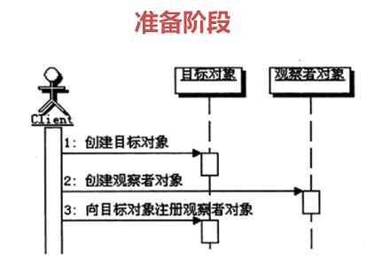
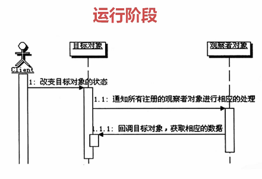

## Java设计模式 ———— 观察者模式

### 一、定义
>观察者模式定义了对象间的一种一对多的依赖关系。当一个对象的状态发生改变时，所有依赖于他的对象都得到通知并被自动更新。

### 二、何时使用

> 1、当一个抽象模型有两个方面，其中一个方面的操作依赖于另一个方面的变化
> 
> 2、如果在更改一个对象的时候，需要同时连带改变其他的对象，而且不知道究竟应该有多少对象需要被连带改变
> 
> 3、当一个对象必须通知其他的对象，但是你又希望这个对象和其他被通知对象是松散耦合的

### 三、调用顺序

### 四、实现方式

（1）推模型

	1、目标对象主动向观察者推送目标的详细信息

	2、推送的信息通常是目标对象的全部或部分数据
  
（2）拉模型

	1、 目标对象在通知观察者的时候，只传递少量信息
	
	2、 如果观察者需要更具体的信息，由观察者主动到目标对象中获取，相当于是观察者从目标对象中拉数据。
	
	3、 一般这种模型的实现中，会把目标对象自身通过update方法传递给观察者。

#### 五、DEMO
> 接下来我们以微信订阅号的例子来说明如何实现

(1) 定义抽象的被观察者接口

	public interface Observerable {
	    /**
	     * 注册观察者
	     * @param observer
	     */
	    public void registerObserver(Observer observer);
	
	    /**
	     * 移除观察者
	     * @param observer
	     */
	    public void removeObserver(Observer observer);
	
	    /**
	     * 通知观察者
	     */
	    public void notifyObserver();
	
	}

（2）实现具体的目标对象，微信订阅号服务

	public class WeChatServer implements Observerable{
	
	    private List<Observer> list = new ArrayList<>();
	
	    @Override
	    public void registerObserver(Observer observer) {
	        list.add(observer);
	    }
	
	    @Override
	    public void removeObserver(Observer observer) {
	        if(!list.isEmpty()){
	            list.remove(observer);
	        }
	    }
	
	    @Override
	    public void notifyObserver() {
	        for(Observer observer : this.list){
	            observer.update("hello world!");
	        }
	    }
	}

（3）定义抽象的观察者接口

	public interface Observer {
	
	    /**
	     * 接收消息更新
	     * @param message
	     */
	    public void update(String message);
	
	}

(4)实现具体的观察者，微信用户

	public class User implements Observer{
	
	    private String name;
	
	    public User(String name) {
	        this.name = name;
	    }
	
	    @Override
	    public void update(String message) {
	        System.out.println(this.name + "收到了一条消息：" + message);
	    }
	}

(5)执行测试

	public class AppTest {
	    
	    public static void main(String[] args) {
	        // 模拟微信订阅号
	        WeChatServer weChatServer = new WeChatServer();
	        // 模拟三个用户
	        User user1 = new User("zhangsan");
	        User user2 = new User("lisi");
	        User user3 = new User("wangwu");
	        // 订阅
	        weChatServer.registerObserver(user1);
	        weChatServer.registerObserver(user2);
	        weChatServer.registerObserver(user3);
	        // 推送消息
	        weChatServer.notifyObserver();
	        System.out.println("----------------------------");
	        // 取消订阅
	        weChatServer.removeObserver(user1);
	        // 再次推送消息
	        weChatServer.notifyObserver();
	    }
	    
	}
(6)执行结果

	zhangsan收到了一条消息：hello world!
	lisi收到了一条消息：hello world!
	wangwu收到了一条消息：hello world!
	----------------------------
	lisi收到了一条消息：hello world!
	wangwu收到了一条消息：hello world!

>
> JDK本身也提供了观察者模式的实现[java.util.observable](https://github.com/skloveln/jdk/blob/master/jdk1.8/src/java/util/Observable.java)和[java.util.Observer](https://github.com/skloveln/jdk/blob/master/jdk1.8/src/java/util/Observer.java)，我们可以直接使用，不需要定义目标对象和观察者的接口了, 有兴趣的可以看一下源码实现
